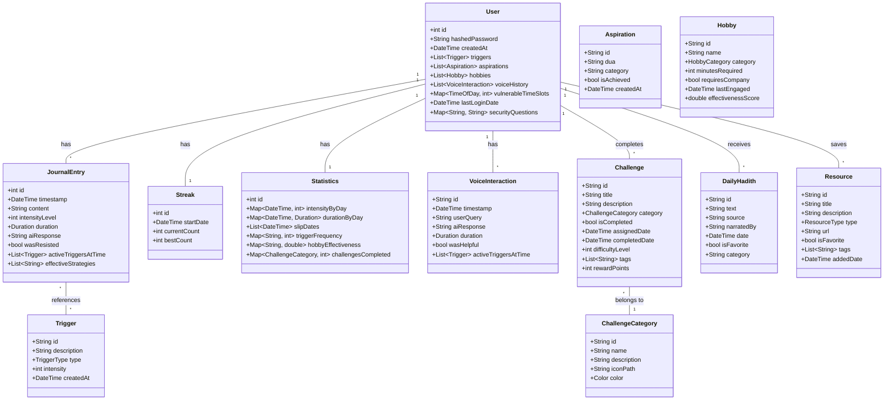

# Temptation Destroyer - App Development Plan

## Overview
Temptation Destroyer is a privacy-focused Flutter application designed to help users overcome sinful behaviors and build positive streaks. The app emphasizes local data storage, encryption, and AI-powered guidance while maintaining user privacy.

## Tech Stack
- **Frontend**: Flutter with Riverpod for state management
- **Local Database**: ObjectBox with encryption
- **AI Integration**: Multiple AI service options (OpenAI, Anthropic, OpenRouter)
- **Voice Interaction**: VAPI for voice-based user support
- **Transcription**: OpenAI Whisper API and on-device models
- **Security**: Local encryption for data protection
- **State Management**: Riverpod for dependency injection and state management

## Architecture

### Core Layer Architecture


### UI Components Architecture


### State Management Architecture


### Service Layer Architecture


### Data Layer Architecture


### Storage Layer Architecture


### AI Integration Architecture


### Voice Interaction Architecture


## Data Models



## Feature Implementation Plan

### Phase 1: Foundation (Week 1-2)
1. Project setup with Flutter and Riverpod
2. ObjectBox integration with encryption
3. Basic UI implementation
4. Authentication system with local password protection

### Phase 2: Core Features (Week 3-4)
1. Journal entry system
2. Basic statistics tracking
3. Streak monitoring
4. Local data encryption/decryption

### Phase 3: AI Integration (Week 5-6)
1. Replicate API integration
2. AI response processing
3. Personalized guidance implementation
4. Response caching for offline use

### Phase 4: Advanced Features (Week 7-8)
1. Advanced statistics and insights
2. Achievement system
3. Data visualization
4. Export/backup functionality

## Security Considerations


## Data Flow


## Clean Architecture Overview


## Updated Folder Structure
```
lib/
├── main.dart
├── core/
│   ├── constants/
│   │   ├── app_constants.dart
│   │   └── error_messages.dart
│   ├── errors/
│   │   ├── exceptions.dart
│   │   └── failures.dart
│   ├── utils/
│   │   ├── encryption_utils.dart
│   │   └── validators.dart
│   └── themes/
│       └── app_theme.dart
├── data/
│   ├── datasources/
│   │   ├── local/
│   │   │   ├── objectbox.dart
│   │   │   └── secure_storage.dart
│   │   └── remote/
│   │       └── replicate_api.dart
│   ├── models/
│   │   ├── user_model.dart
│   │   ├── journal_model.dart
│   │   ├── streak_model.dart
│   │   └── statistics_model.dart
│   └── repositories/
│       ├── auth_repository_impl.dart
│       ├── journal_repository_impl.dart
│       └── stats_repository_impl.dart
├── domain/
│   ├── entities/
│   │   ├── user.dart
│   │   ├── journal_entry.dart
│   │   ├── streak.dart
│   │   └── statistics.dart
│   ├── repositories/
│   │   ├── auth_repository.dart
│   │   ├── journal_repository.dart
│   │   └── stats_repository.dart
│   └── usecases/
│       ├── auth/
│       │   ├── login_usecase.dart
│       │   └── verify_password_usecase.dart
│       ├── journal/
│       │   ├── add_entry_usecase.dart
│       │   └── get_entries_usecase.dart
│       └── stats/
│           ├── calculate_streak_usecase.dart
│           └── generate_insights_usecase.dart
└── presentation/
    ├── providers/
    │   ├── auth_provider.dart
    │   ├── journal_provider.dart
    │   └── stats_provider.dart
    ├── controllers/
    │   ├── auth_controller.dart
    │   ├── journal_controller.dart
    │   └── stats_controller.dart
    └── views/
        ├── auth/
        │   ├── login_page.dart
        │   └── widgets/
        ├── journal/
        │   ├── journal_page.dart
        │   └── widgets/
        ├── stats/
        │   ├── stats_page.dart
        │   └── widgets/
        └── shared/
            └── widgets/
```

## Layer Responsibilities

### Presentation Layer
- **Views**: Flutter widgets and pages
- **Controllers**: Handle UI logic and state management
- **Providers**: Riverpod providers for dependency injection and state

### Domain Layer
- **Entities**: Core business objects
- **Repository Interfaces**: Abstract definitions of data operations
- **Use Cases**: Single-responsibility business logic units

### Data Layer
- **Models**: Data objects that implement entities
- **Repository Implementations**: Concrete implementations of repository interfaces
- **Data Sources**: ObjectBox and API implementations

## Implementation Flow
1. **Domain Layer First**
   - Define entities
   - Create repository interfaces
   - Implement use cases

2. **Data Layer Second**
   - Implement ObjectBox models
   - Create repository implementations
   - Set up data sources

3. **Presentation Layer Last**
   - Implement providers
   - Create controllers
   - Build UI components

## Next Steps
1. Set up the Flutter project with the required dependencies
2. Implement the basic project structure
3. Set up ObjectBox with encryption
4. Create the authentication system
5. Begin implementing the core features

## Dependencies to Add
```yaml
dependencies:
  flutter:
    sdk: flutter
  riverpod: ^2.4.9
  flutter_riverpod: ^2.4.9
  objectbox: ^2.5.0
  objectbox_flutter_libs: ^2.5.0
  http: ^1.1.0
  encrypt: ^5.0.3
  shared_preferences: ^2.2.2
  fl_chart: ^0.66.0
  intl: ^0.19.0
```

## Additional Dependencies for Clean Architecture
```yaml
dependencies:
  # Previously listed dependencies remain...
  dartz: ^0.10.1  # For functional programming and error handling
  equatable: ^2.0.5  # For value equality
  freezed: ^2.4.7  # For immutable models
  freezed_annotation: ^2.4.1
  json_annotation: ^4.8.1

dev_dependencies:
  build_runner: ^2.4.8
  freezed_generator: ^2.4.7
  json_serializable: ^6.7.1
  objectbox_generator: ^2.5.0
```

## Implementation Details

### Trigger Management
```dart
enum TriggerType {
  timePattern,
  emotional,
  situational,
  custom
}

class TriggerManager {
  // Track vulnerable time slots
  Map<TimeOfDay, int> vulnerableTimeSlots;
  
  // Track emotional triggers
  List<String> emotionalTriggers;
  
  // Calculate risk level based on current time
  double calculateCurrentRiskLevel();
  
  // Suggest preventive actions based on triggers
  List<String> suggestPreventiveActions();
}
```

### Aspiration System
```dart
enum AspirationCategory {
  personalGrowth,
  career,
  spiritual,
  family,
  social,
  custom
}

class AspirationManager {
  // Store and categorize aspirations
  Map<AspirationCategory, List<String>> aspirations;
  
  // Get relevant aspirations for motivation
  List<String> getRelevantAspirations(TriggerType trigger);
  
  // Track progress towards aspirations
  void updateAspirationProgress(String aspiration, double progress);
}
```

### AI Context Builder
```dart
class AIContextBuilder {
  String buildContext({
    required List<Trigger> activeTriggers,
    required List<Aspiration> relevantAspirations,
    required List<Hobby> availableHobbies,
    required int currentStreak,
  }) {
    // Build personalized context for AI response
    // Include active triggers, relevant aspirations,
    // suggested hobbies, and current progress
  }
}
```

### Hobby Management
```dart
enum HobbyCategory {
  physical,    // walking, sports
  creative,    // coding, art
  social,      // meeting friends
  relaxing,    // reading, meditation
  caregiving,  // feeding pets
  custom
}

class HobbyManager {
  // Store and categorize hobbies
  Map<HobbyCategory, List<Hobby>> hobbies;
  
  // Get suitable hobbies based on current context
  List<Hobby> getSuggestedHobbies({
    required int availableMinutes,
    required bool isAlone,
    required TimeOfDay currentTime,
  });
  
  // Track hobby engagement
  void recordHobbyEngagement(Hobby hobby, Duration duration);
  
  // Get most effective distracting hobbies
  List<Hobby> getMostEffectiveHobbies();
}
```

## Trigger Response Flow


### Trigger Response Components

1. **"I Need Help" Button**
   - Prominent floating action button always visible in the app
   - Quick access from notification shade widget
   - Haptic feedback on press for grounding

2. **Quick Response Dialog**
   ```
   ┌─────────────────────────┐
   │    How can we help?     │
   ├─────────────────────────┤
   │ ⚡️ Help Me Now          │
   │ 📝 Record Trigger Only  │
   └─────────────────────────┘
   ```

3. **Emergency Response Screen**
   - Immediate AI guidance
   - Quick access to:
     * Your aspirations
     * Suggested hobbies
     * Emergency contacts
     * Grounding exercises
   - Timer to track episode duration
   - "I'm Better Now" button

4. **Resolution Form**
   ```
   ┌─────────────────────────┐
   │   Episode Resolution    │
   ├─────────────────────────┤
   │ Duration: [Auto/Manual] │
   │ Intensity: [1-5 Scale]  │
   │ Success?: [Yes/No]      │
   │ Notes: [Optional]       │
   └─────────────────────────┘
   ```

### Statistics Recording

1. **Automatic Tracking**
   - Episode start time (when help button pressed)
   - Duration (if using emergency help)
   - Time of day patterns
   - Response time to triggers

2. **Manual Input**
   - Intensity level (1-5)
   - Success/failure in resisting
   - Trigger categories involved
   - Effective countermeasures

3. **Metrics Stored**
   ```dart
   class TriggerEpisode {
     DateTime startTime;
     DateTime endTime;
     Duration duration;
     int intensityLevel;
     bool wasResisted;
     List<Trigger> activeTriggers;
     List<String> effectiveStrategies;
     String? notes;
   }
   ```

### Dashboard Integration

1. **Real-time Stats**
   - Current streak
   - Success rate
   - Average intensity
   - Common triggers

2. **Progress Indicators**
   - Weekly strength trend
   - Most vulnerable times
   - Most effective strategies
   - Streak milestones

### Implementation Details

```dart
class ActiveEmergencySession {
  final String id;
  final DateTime startTime;
  final List<String> activeTriggerIds;
  final String? initialNotes;
  final bool wasAIGuidanceShown;
  
  const ActiveEmergencySession({
    required this.id,
    required this.startTime,
    required this.activeTriggerIds,
    this.initialNotes,
    this.wasAIGuidanceShown = false,
  });

  // Convert to/from JSON for SharedPreferences
  Map<String, dynamic> toJson() => {
    'id': id,
    'startTime': startTime.toIso8601String(),
    'activeTriggerIds': activeTriggerIds,
    'initialNotes': initialNotes,
    'wasAIGuidanceShown': wasAIGuidanceShown,
  };

  factory ActiveEmergencySession.fromJson(Map<String, dynamic> json) {
    return ActiveEmergencySession(
      id: json['id'],
      startTime: DateTime.parse(json['startTime']),
      activeTriggerIds: List<String>.from(json['activeTriggerIds']),
      initialNotes: json['initialNotes'],
      wasAIGuidanceShown: json['wasAIGuidanceShown'] ?? false,
    );
  }
}

class EmergencySessionManager {
  static const String _activeSessionKey = 'active_emergency_session';
  final SharedPreferences _prefs;
  
  // Check if there's an active emergency session
  Future<ActiveEmergencySession?> getActiveSession() async {
    final sessionJson = _prefs.getString(_activeSessionKey);
    if (sessionJson == null) return null;
    
    try {
      return ActiveEmergencySession.fromJson(
        jsonDecode(sessionJson)
      );
    } catch (e) {
      // If there's an error parsing, clear the invalid session
      await _prefs.remove(_activeSessionKey);
      return null;
    }
  }
  
  // Start a new emergency session
  Future<void> startSession(ActiveEmergencySession session) async {
    await _prefs.setString(
      _activeSessionKey,
      jsonEncode(session.toJson())
    );
  }
  
  // Update AI guidance shown status
  Future<void> markAIGuidanceShown() async {
    final current = await getActiveSession();
    if (current == null) return;
    
    final updated = ActiveEmergencySession(
      id: current.id,
      startTime: current.startTime,
      activeTriggerIds: current.activeTriggerIds,
      initialNotes: current.initialNotes,
      wasAIGuidanceShown: true,
    );
    
    await startSession(updated);
  }
  
  // Clear the active session
  Future<void> endSession() async {
    await _prefs.remove(_activeSessionKey);
  }
}

class TriggerResponseManager {
  final EmergencySessionManager _sessionManager;
  final AIGuidanceManager _aiManager;
  final StatisticsManager _statsManager;
  
  // Check for active session on app start
  Future<void> checkForActiveSession() async {
    final activeSession = await _sessionManager.getActiveSession();
    if (activeSession == null) return;
    
    // Calculate elapsed duration
    final elapsedDuration = DateTime.now().difference(activeSession.startTime);
    
    // Show emergency screen with elapsed time
    _showEmergencyScreen(
      sessionId: activeSession.id,
      elapsedDuration: elapsedDuration,
      wasAIGuidanceShown: activeSession.wasAIGuidanceShown,
    );
  }

  // Start a new trigger episode
  Future<void> startEpisode() async {
    final sessionId = const Uuid().v4();
    final activeTriggers = await _getCurrentTriggers();
    
    // Create and persist session
    final session = ActiveEmergencySession(
      id: sessionId,
      startTime: DateTime.now(),
      activeTriggerIds: activeTriggers.map((t) => t.id.toString()).toList(),
    );
    
    await _sessionManager.startSession(session);
    
    // Get immediate AI help
    final guidance = await _aiManager.getGuidance(activeTriggers);
    
    // Show response screen
    _showEmergencyScreen(
      sessionId: sessionId,
      elapsedDuration: Duration.zero,
      wasAIGuidanceShown: false,
    );
    
    // Mark AI guidance as shown
    await _sessionManager.markAIGuidanceShown();
  }
  
  // Record episode resolution
  Future<void> resolveEpisode({
    required String sessionId,
    required int intensity,
    required bool wasResisted,
    String? notes,
  }) async {
    final session = await _sessionManager.getActiveSession();
    if (session == null || session.id != sessionId) {
      throw Exception('No matching session found');
    }
    
    final episode = TriggerEpisode(
      startTime: session.startTime,
      endTime: DateTime.now(),
      duration: DateTime.now().difference(session.startTime),
      intensityLevel: intensity,
      wasResisted: wasResisted,
      activeTriggers: await _getTriggersFromIds(session.activeTriggerIds),
      notes: notes,
    );
    
    // Update statistics
    await _statsManager.recordEpisode(episode);
    
    // Update streak
    if (wasResisted) {
      await _streakManager.incrementStreak();
    } else {
      await _streakManager.resetStreak();
    }
    
    // Clear the active session
    await _sessionManager.endSession();
    
    // Show appropriate feedback
    _showResolutionFeedback(wasResisted);
  }
}

### Session Persistence Flow


This approach ensures:
1. No emergency session is lost if the app is closed
2. Timer continues from the original start time
3. AI guidance state is preserved
4. Session can be properly resolved even after app restarts

### Voice Integration System
```dart
// VAPI Service for handling voice interactions
class VAPIService {
  final String apiKey;
  final AIContextBuilder contextBuilder;
  
  // Initialize voice agent with user preferences
  Future<void> initializeVoiceAgent();
  
  // Start voice interaction session
  Future<void> startVoiceSession();
  
  // Process voice input and get AI response
  Future<String> processVoiceInput(String voiceInput);
  
  // End voice interaction session
  Future<void> endVoiceSession();
  
  // Save voice interaction history
  Future<void> saveInteraction(VoiceInteraction interaction);
}

// Voice State Management
class VoiceStateNotifier extends StateNotifier<VoiceState> {
  final VAPIService vapiService;
  
  // Track current voice session state
  bool get isSessionActive => state.isActive;
  
  // Start new voice interaction
  Future<void> startInteraction();
  
  // Handle voice input processing
  Future<void> processInput(String input);
  
  // End current interaction
  Future<void> endInteraction();
}

// Voice UI Components
class VoiceInteractionButton extends StatelessWidget {
  // Floating action button for voice input
  // Animates and shows feedback during voice session
}

class VoiceResponseDialog extends StatelessWidget {
  // Dialog showing AI response with option to:
  // - Continue conversation
  // - End session
  // - Rate helpfulness
}

// Voice Interaction Repository
class VoiceInteractionRepository {
  final ObjectBox _db;
  
  // Save voice interaction to local storage
  Future<void> saveInteraction(VoiceInteraction interaction);
  
  // Get voice interaction history
  Future<List<VoiceInteraction>> getInteractionHistory();
  
  // Get most helpful interactions
  Future<List<VoiceInteraction>> getMostHelpfulInteractions();
}

// Integration with Emergency Response System
extension VoiceEmergencyResponse on EmergencyResponseManager {
  // Start voice-based emergency session
  Future<void> startVoiceEmergencySession() async {
    final session = await _sessionManager.startSession();
    final vapiService = ref.read(vapiServiceProvider);
    
    // Initialize voice agent with emergency context
    await vapiService.startVoiceSession();
    
    // Get immediate voice-based guidance
    final guidance = await _aiManager.getVoiceGuidance(
      session.activeTriggers,
      session.currentStreak
    );
    
    // Show voice response UI
    _showVoiceEmergencyScreen(
      sessionId: session.id,
      initialGuidance: guidance
    );
  }
}
```

## Implementation Strategy (Clean Architecture Approach)

### Architecture Layers Order
1. **Models (Data Classes)**
   - Start with core models: `UserModel`, `TriggerModel`, `HobbyModel`, `AspirationModel`, `EmergencySessionModel`
   - These will form the foundation of all app features

2. **Repositories**
   - Set up ObjectBox with encryption for local storage
   - Create repositories for each core feature starting with `UserRepository`
   - Implement data persistence and retrieval logic

3. **Providers/Controllers**
   - Set up Riverpod providers for state management
   - Create providers for each feature: `OnboardingProvider`, `EmergencyProvider`, etc.
   - Implement business logic for each feature

4. **Views (Pages)**
   - Implement UI components following the design system
   - Create navigation flow between screens

### Implementation Sequence

1. **Basic App Structure (Days 1-2)**
   - Project setup with proper folder structure
   - Core dependencies configuration
   - Routing setup

2. **Onboarding Flow (Days 3-4)**
   - Welcome Screen with encouraging message about taking first step
   - Trigger Collection Screen for identifying triggers
   - Hobbies Selection Screen for alternative activities
   - Aspirations/Goals/Duas Screen for motivation
   - Connect to repositories to save user data

3. **Dashboard & Emergency Feature (Days 5-7)**
   - Dashboard with streak display and quick access buttons
   - Emergency response screen with timer
   - Suggested activities during emergency
   - Resolution form for tracking outcomes

4. **Chat & Progress Features (Days 8-10)**
   - Chat interface for AI interaction
   - Progress tracking screen
   - Settings page with API key input option
   - Voice interaction features

### User Flow

1. **First Launch**
   - User sees welcome message with encouragement
   - App explains its purpose and how it can help
   - No login required initially to reduce barriers

2. **Onboarding**
   - User identifies their triggers (times, emotions, situations)
   - User selects hobbies and alternative activities
   - User sets goals and makes duas for motivation

3. **Main App Usage**
   - Dashboard shows progress and provides quick access to features
   - Emergency button always available for immediate help
   - Chat functionality for ongoing support
   - Progress tracking for accountability

4. **Advanced Features**
   - Daily challenges for continued motivation
   - Educational resources for deeper understanding
   - Voice interaction for hands-free support

## Authentication Security Considerations

### Password Security
1. **Implement clear security warnings:**
   - Add prominent warning during password creation that if password is forgotten, data cannot be recovered
   - Include confirmation dialog requiring users to type "I understand" before proceeding
   - Offer option to write down password in a safe place
   - Explain encryption simply: "Your data is locked with this password and cannot be unlocked without it"
   - Provide guidance on creating a memorable but secure password

### Encryption Implementation
1. **AES-256 Encryption Strategy:**
   - Use the `encrypt` package with AES-256 in CBC mode
   - Generate random encryption key for first-time users
   - Store encryption key in secure storage (Keychain/KeyStore)
   - Protect key with user's password using PBKDF2
   - Implement secure password recovery mechanism
   - Encrypt all sensitive data including chat history if enabled

## User Experience Considerations

### Engaging and Supportive Interface
1. **Add appropriate humor and encouraging tone throughout the app:**
   - Include light-hearted messages in loading screens
   - Use gentle humor in success messages for completed tasks
   - Add supportive messages that acknowledge the difficulty of the journey
   - Balance seriousness of addiction recovery with optimistic, hopeful messaging
   - Design encouragement messages that don't feel patronizing
   - Incorporate occasional appropriate Islamic humor where suitable
   - Create uplifting animations for achievements and milestones
   - Use friendly, conversational language rather than clinical terms

### Chat Storage Strategy
1. **Implement secure chat storage:**
   - Store chats locally only (no remote storage)
   - Make chat history optional (disabled by default)
   - Encrypt all stored messages using the same encryption as other app data
   - Add settings to control chat retention period (7, 30, 90 days options)
   - Create clear history button with confirmation dialog
   - Implement automatic history deletion based on settings
   - Add privacy notice explaining chat storage approach
   - Implement history browsing with date filtering
   - Add message-level deletion for individual messages

### OpenAI Integration Privacy
1. **Implement user-friendly AI service integration:**
   - Provide three AI service options for users to choose from:
     * OpenAI API (GPT models)
     * Anthropic API (Claude models)
     * OpenRouter API (unified access to multiple models)
   - Add clear explanations about how each AI service works
   - Inform users that communications are encrypted via HTTPS
   - Provide information about each service's data usage policies
   - Include guidance on how to opt out of data training for each service
   - Give users the option to use their own API key for complete control
   - Implement minimal data sharing - only send necessary context to AI services
   - Add option to use offline guidance only for users with privacy concerns
   - Create privacy-focused templates that avoid sending sensitive personal details
   - Allow users to easily switch between AI services in settings

## AI Service Implementation

### AI Service Selection
```dart
enum AIServiceType {
  openAI,
  anthropic,
  openRouter,
  offline
}

class AIServiceConfig {
  final AIServiceType serviceType;
  final String? apiKey;
  final String? preferredModel;
  final bool allowDataTraining;
  
  const AIServiceConfig({
    required this.serviceType,
    this.apiKey,
    this.preferredModel,
    this.allowDataTraining = false,
  });
  
  // Convert to/from encrypted JSON for secure storage
  Map<String, dynamic> toJson() => {
    'serviceType': serviceType.toString(),
    'apiKey': apiKey,
    'preferredModel': preferredModel,
    'allowDataTraining': allowDataTraining,
  };
  
  factory AIServiceConfig.fromJson(Map<String, dynamic> json) {
    return AIServiceConfig(
      serviceType: AIServiceType.values.firstWhere(
        (e) => e.toString() == json['serviceType'],
        orElse: () => AIServiceType.offline,
      ),
      apiKey: json['apiKey'],
      preferredModel: json['preferredModel'],
      allowDataTraining: json['allowDataTraining'] ?? false,
    );
  }
}

// Factory for creating appropriate AI service client
class AIServiceFactory {
  static AIService createService(AIServiceConfig config) {
    switch (config.serviceType) {
      case AIServiceType.openAI:
        return OpenAIService(
          apiKey: config.apiKey,
          model: config.preferredModel ?? 'gpt-3.5-turbo',
        );
      case AIServiceType.anthropic:
        return AnthropicService(
          apiKey: config.apiKey,
          model: config.preferredModel ?? 'claude-3-haiku',
        );
      case AIServiceType.openRouter:
        return OpenRouterService(
          apiKey: config.apiKey,
          model: config.preferredModel,
        );
      case AIServiceType.offline:
      default:
        return OfflineAIService();
    }
  }
}
```

## Daily Challenges System


### Daily Challenges Implementation

```dart
enum ChallengeCategory {
  digitalDetox,
  fajrChampion,
  knowledgeSeeker,
  physicalStrength,
  general
}

class ChallengeManager {
  final ChallengeRepository _repository;
  final HadithRepository _hadithRepository;
  
  // Generate a new daily challenge
  Future<Challenge> generateDailyChallenge() async {
    // Check user's strength areas and weaknesses
    final stats = await _statsRepository.getStatistics();
    final userTriggers = await _triggerRepository.getTriggers();
    
    // Select appropriate category based on user's needs
    final category = _selectChallengeCategory(stats, userTriggers);
    
    // Get challenges for selected category
    final challenges = await _repository.getChallengesByCategory(category);
    
    // Filter for challenges the user hasn't completed recently
    final eligibleChallenges = _filterRecentlyCompleted(challenges);
    
    // Select challenge based on user's current streak
    final selectedChallenge = _selectAppropriateChallenge(
      eligibleChallenges,
      stats.currentStreak
    );
    
    // Assign today's date to challenge
    final todaysChallenge = selectedChallenge.copyWith(
      assignedDate: DateTime.now(),
      isCompleted: false
    );
    
    // Save and return challenge
    await _repository.saveAssignedChallenge(todaysChallenge);
    return todaysChallenge;
  }
  
  // Get daily hadith
  Future<DailyHadith> getDailyHadith() async {
    // Check if today's hadith already exists
    final today = DateTime.now();
    final todaysHadith = await _hadithRepository.getHadithForDate(today);
    
    if (todaysHadith != null) {
      return todaysHadith;
    }
    
    // Select new hadith that hasn't been shown recently
    final newHadith = await _hadithRepository.getRandomHadith(
      excludeRecentlyShown: true
    );
    
    // Assign today's date
    final dailyHadith = newHadith.copyWith(date: today);
    
    // Save and return hadith
    await _hadithRepository.saveDailyHadith(dailyHadith);
    return dailyHadith;
  }
  
  // Mark challenge as completed
  Future<void> completeChallenge(String challengeId) async {
    final challenge = await _repository.getChallenge(challengeId);
    if (challenge == null) return;
    
    final completed = challenge.copyWith(
      isCompleted: true,
      completedDate: DateTime.now()
    );
    
    // Update challenge
    await _repository.updateChallenge(completed);
    
    // Update statistics
    await _statsRepository.incrementChallengesCompleted(challenge.category);
    
    // Check for achievements
    await _checkForAchievements(challenge.category);
  }
  
  // Get completion statistics
  Future<Map<ChallengeCategory, double>> getChallengeCompletionRates() async {
    final allChallenges = await _repository.getAllAssignedChallenges();
    
    // Group by category
    final Map<ChallengeCategory, List<Challenge>> categorized = {};
    for (final challenge in allChallenges) {
      categorized.putIfAbsent(challenge.category, () => []).add(challenge);
    }
    
    // Calculate completion rates
    final Map<ChallengeCategory, double> completionRates = {};
    categorized.forEach((category, challenges) {
      final total = challenges.length;
      final completed = challenges.where((c) => c.isCompleted).length;
      completionRates[category] = total > 0 ? completed / total : 0.0;
    });
    
    return completionRates;
  }
}
```

### Challenge Repository Implementation

```dart
class ChallengeRepository {
  final ObjectBox _db;
  
  // Get predefined challenges by category
  Future<List<Challenge>> getChallengesByCategory(ChallengeCategory category) async {
    return _db.challengeBox.query(
      Challenge_.category.equals(category.index)
    ).build().find();
  }
  
  // Get challenges assigned to user
  Future<List<Challenge>> getAssignedChallenges({
    DateTime? fromDate,
    DateTime? toDate,
    bool? completedOnly,
  }) async {
    final query = _db.challengeBox.query(
      Challenge_.assignedDate.notEquals(0)
    );
    
    if (fromDate != null) {
      query.and(Challenge_.assignedDate.greaterOrEqual(
        fromDate.millisecondsSinceEpoch
      ));
    }
    
    if (toDate != null) {
      query.and(Challenge_.assignedDate.lessOrEqual(
        toDate.millisecondsSinceEpoch
      ));
    }
    
    if (completedOnly != null) {
      query.and(Challenge_.isCompleted.equals(completedOnly));
    }
    
    return query.build().find();
  }
  
  // Save assigned challenge
  Future<void> saveAssignedChallenge(Challenge challenge) async {
    _db.challengeBox.put(challenge);
  }
  
  // Update challenge (e.g., mark as completed)
  Future<void> updateChallenge(Challenge challenge) async {
    _db.challengeBox.put(challenge);
  }
  
  // Get challenges for synchronization (cloud backup)
  Future<List<Challenge>> getChallengesForSync(DateTime lastSyncTime) async {
    return _db.challengeBox.query(
      Challenge_.assignedDate.greaterThan(lastSyncTime.millisecondsSinceEpoch)
    ).or(
      Challenge_.completedDate.greaterThan(lastSyncTime.millisecondsSinceEpoch)
    ).build().find();
  }
}
```

### Hadith Repository Implementation

```dart
class HadithRepository {
  final ObjectBox _db;
  
  // Get hadith for specific date
  Future<DailyHadith?> getHadithForDate(DateTime date) async {
    final startOfDay = DateTime(date.year, date.month, date.day);
    final endOfDay = startOfDay.add(Duration(days: 1)).subtract(Duration(milliseconds: 1));
    
    final results = _db.hadithBox.query(
      DailyHadith_.date.greaterOrEqual(startOfDay.millisecondsSinceEpoch)
    ).and(
      DailyHadith_.date.lessOrEqual(endOfDay.millisecondsSinceEpoch)
    ).build().find();
    
    return results.isNotEmpty ? results.first : null;
  }
  
  // Get random hadith
  Future<DailyHadith> getRandomHadith({bool excludeRecentlyShown = true}) async {
    if (excludeRecentlyShown) {
      // Get recently shown hadiths (last 30 days)
      final thirtyDaysAgo = DateTime.now().subtract(Duration(days: 30));
      final recentHadiths = _db.hadithBox.query(
        DailyHadith_.date.greaterOrEqual(thirtyDaysAgo.millisecondsSinceEpoch)
      ).build().find();
      
      // Get all hadiths
      final allHadiths = _db.hadithBox.getAll();
      
      // Remove recently shown hadiths
      final eligibleHadiths = allHadiths.where(
        (h) => !recentHadiths.any((r) => r.id == h.id)
      ).toList();
      
      if (eligibleHadiths.isNotEmpty) {
        return eligibleHadiths[Random().nextInt(eligibleHadiths.length)];
      }
    }
    
    // If no eligible hadiths or not excluding recently shown
    final allHadiths = _db.hadithBox.getAll();
    return allHadiths[Random().nextInt(allHadiths.length)];
  }
  
  // Save daily hadith
  Future<void> saveDailyHadith(DailyHadith hadith) async {
    _db.hadithBox.put(hadith);
  }
  
  // Toggle favorite status
  Future<void> toggleFavorite(String hadithId) async {
    final hadith = _db.hadithBox.get(int.parse(hadithId));
    if (hadith != null) {
      hadith.isFavorite = !hadith.isFavorite;
      _db.hadithBox.put(hadith);
    }
  }
  
  // Get favorite hadiths
  Future<List<DailyHadith>> getFavoriteHadiths() async {
    return _db.hadithBox.query(
      DailyHadith_.isFavorite.equals(true)
    ).build().find();
  }
}
```

### Challenge UI Components

```dart
class DailyHadithCard extends StatelessWidget {
  final DailyHadith hadith;
  final Function(String) onToggleFavorite;
  
  // UI component showing daily hadith with favorite toggle
}

class ChallengeOfTheDayWidget extends StatelessWidget {
  final Challenge challenge;
  final Function(String) onComplete;
  
  // UI component showing daily challenge with completion button
}

class ChallengeHistoryScreen extends StatefulWidget {
  // Screen showing history of completed challenges
}

class ChallengeCompletionDialog extends StatelessWidget {
  final Challenge completedChallenge;
  
  // Dialog showing congratulations and rewards for completing a challenge
}

class CategoryBasedChallengeList extends StatelessWidget {
  final ChallengeCategory category;
  
  // List of challenges filtered by category
}
```

### Integration with Streak System

```dart
extension ChallengeStreakIntegration on StreakManager {
  // Provide streak-based challenge difficulty
  int getChallengeDifficultyForCurrentStreak() {
    final streak = currentStreak;
    if (streak < 7) return 1; // Easy
    if (streak < 30) return 2; // Medium
    return 3; // Hard
  }
  
  // Award bonus streak days for challenging completions
  Future<void> awardBonusStreakDay(Challenge challenge) async {
    if (challenge.difficultyLevel >= 3) {
      // Award bonus day for completing difficult challenges
      await incrementStreakByDays(1);
    }
  }
}
```

### Integration with Statistics System

```dart
extension ChallengeStatsIntegration on StatisticsManager {
  // Record challenge completion in statistics
  Future<void> recordChallengeCompletion(Challenge challenge) async {
    final stats = await getStatistics();
    
    // Update challenges completed count for category
    final categoryCompletions = stats.challengesCompleted ?? {};
    final currentCount = categoryCompletions[challenge.category] ?? 0;
    categoryCompletions[challenge.category] = currentCount + 1;
    
    // Update stats
    await updateStatistics(stats.copyWith(
      challengesCompleted: categoryCompletions
    ));
  }
  
  // Get challenge category success rates
  Future<Map<ChallengeCategory, double>> getChallengeSuccessRates() async {
    final challenges = await _challengeRepository.getAssignedChallenges();
    
    // Group by category
    final Map<ChallengeCategory, List<Challenge>> categorizedChallenges = {};
    for (final challenge in challenges) {
      categorizedChallenges.putIfAbsent(challenge.category, () => [])
        .add(challenge);
    }
    
    // Calculate success rate for each category
    final Map<ChallengeCategory, double> successRates = {};
    categorizedChallenges.forEach((category, challenges) {
      final assigned = challenges.length;
      final completed = challenges.where((c) => c.isCompleted).length;
      successRates[category] = assigned > 0 ? completed / assigned : 0.0;
    });
    
    return successRates;
  }
}
```

## Educational Resources System


### Resource System Implementation

```dart
enum ResourceType {
  article,
  video,
  audio,
  pdf,
  custom
}

class ResourceManager {
  final ResourceRepository _repository;
  
  // Get resources by category
  Future<List<Resource>> getResourcesByCategory(String category) async {
    return _repository.getResourcesByCategory(category);
  }
  
  // Toggle favorite status
  Future<void> toggleFavorite(String resourceId) async {
    await _repository.toggleFavorite(resourceId);
  }
  
  // Get favorite resources
  Future<List<Resource>> getFavoriteResources() async {
    return _repository.getFavoriteResources();
  }
  
  // Add custom resource
  Future<void> addCustomResource(Resource resource) async {
    await _repository.saveResource(resource);
  }
  
  // Open resource (launch URL, etc.)
  Future<void> openResource(Resource resource) async {
    switch (resource.type) {
      case ResourceType.video:
        await launchUrl(Uri.parse(resource.url));
        break;
      case ResourceType.article:
        // Open in-app article viewer
        break;
      // Handle other resource types
    }
  }
}
```

## Voice Transcription System


### Voice Transcription Flow


### Voice Integration Points

The voice transcription system will be integrated throughout the app to make data entry more convenient for users:

1. **Onboarding Flow**
   - Triggers identification through voice
   - Hobby description via voice input
   - Aspirations and goals spoken naturally

2. **Emergency Response**
   - Voice-activated emergency help
   - Verbal descriptions of current state
   - Voice commands for selecting activities

3. **Journal Entries**
   - Voice dictation for journal content
   - Spoken intensity ratings
   - Verbal notes during resolution

4. **Chat Interface**
   - Full voice conversation support
   - Real-time transcription during chat
   - Voice response playback

5. **Hobby & Trigger Management**
   - Voice input for adding new items
   - Natural language parsing for details
   - Voice search functionality

### Transcription Provider Options

Users will have multiple options for voice transcription:

1. **OpenAI Whisper API**
   - High accuracy across languages
   - Requires internet connection
   - Uses user's OpenAI API key

2. **Assembly AI** (optional)
   - Specialized in high-quality transcription
   - Good for long recordings
   - Requires separate API key

3. **Local Whisper Model**
   - Works offline
   - Lower accuracy but more private
   - Uses device resources

4. **System Speech Recognition**
   - Native device capabilities
   - No additional API needed
   - Variable quality based on device

The system will extract structured data from natural speech, making it easy for users to add information with minimal typing.

## Feature List

1. **Local Authentication System**
   - Password protection with encryption
   - Secure storage of user data
   - No account or cloud login required
   - Optional biometric authentication

2. **Emergency Response System**
   - One-tap emergency help
   - Personalized coping strategies
   - Timer-based distraction
   - Recovery tracking
   - Voice-activated emergency mode

3. **Trigger Management**
   - Identification of personal triggers
   - Categorization (emotional, situational, time-based)
   - Pattern recognition
   - AI-powered trigger analysis
   - Trigger intensity tracking

4. **Aspirations & Goals**
   - Setting personal aspirations
   - Islamic duas for strength
   - Goal visualization
   - Progress tracking
   - Reminder system

5. **Alternative Activities Management**
   - Hobby suggestions based on time available
   - Activity scheduling
   - Engagement tracking
   - Personalized recommendations
   - Quick-access favorites

6. **AI Guidance & Support**
   - Personalized advice
   - Islamic perspective on recovery
   - Scientific insights integration
   - Contextual help based on user situation
   - Multiple AI service options
   - Voice-based interaction

7. **Statistics & Progress Tracking**
   - Streak calendar
   - Progress graphs
   - Insight generation
   - Pattern identification
   - Recovery timeline

8. **Daily Challenges & Reminders**
   - Personalized daily challenges
   - Category-based challenges (digital detox, fajr champion, etc.)
   - Challenge history
   - Completion tracking
   - Daily hadith
   - Customized notification system

9. **Educational Resources**
   - Science of addiction
   - Islamic perspective
   - Success stories
   - Recovery strategies
   - In-app article reader
   - Video integration

10. **Voice Transcription & Input**
    - Voice commands throughout app
    - Voice journal entries
    - Voice-based trigger recording
    - Transcription for all text inputs
    - Multiple transcription service options
    - Offline voice recognition
    
11. **Achievements & Gamification System**
    - Achievement unlocking system
    - Trophy collection
    - Level progression system (New Journeyer → advanced levels)
    - Experience points for positive actions
    - Visual rewards
    - Specific achievements:
      - Turquoise Prayer Mat (30 days of consistent prayers)
      - Ruby Lantern (Complete 10 daily challenges)
      - Jade Manuscript (Complete 20 daily reflections)
      - Amethyst Shield (Successfully use emergency tool 5 times)
    - Progress visualization
    - Level benefits (unlock new features, achievements)
    - Achievement categories (prayer, challenges, reflection, emergency)
    - Celebration animations for milestone achievements

## Core Data Models

```dart
// User Model
class User {
  int id
  String hashedPassword
  DateTime lastLoginDate
  List<SecurityQuestion> securityQuestions
  String? customApiKey
  bool isDarkMode
  bool useLocalAIOnly
  bool storeChatHistory
  bool enableNotifications
  bool enableVoiceFeatures
  DateTime onboardingCompletedDate
  bool hasCompletedInitialSetup
}

// Emergency Session Model
class EmergencySession {
  String id
  DateTime startTime
  DateTime? endTime
  int durationSeconds
  EmergencySessionOutcome outcome
  String? notes
  List<String> triggersIdentified
  List<String> strategiesUsed
  bool wasAIUsed
  int intensityAtStart
  int intensityAtEnd
}

// Trigger Model
class Trigger {
  int id
  String description
  TriggerType type
  int intensity
  DateTime createdAt
  List<String> associatedEmotions
  List<DateTime> occurrences
  String? notes
  int frequencyScore
}

// Aspiration Model
class Aspiration {
  int id
  String content
  String category
  bool isAchieved
  DateTime createdAt
  DateTime? achievedDate
  String? notes
  List<String> relatedGoals
}

// Hobby Model
class Hobby {
  int id
  String name
  HobbyCategory category
  int minutesRequired
  bool requiresCompany
  DateTime lastEngaged
  int satisfactionRating
  String? notes
  List<String> tags
}

// Challenge Model
class Challenge {
  int id
  String title
  String description
  ChallengeCategory category
  bool isCompleted
  DateTime assignedDate
  DateTime? completedDate
  int difficultyLevel
  List<String> tags
  int rewardPoints
}

// Daily Hadith Model
class DailyHadith {
  int id
  String text
  String source
  String narratedBy
  DateTime date
  bool isFavorite
  String category
}

// Voice Input Session Model
class VoiceInputSession {
  String id
  DateTime timestamp
  String rawAudioPath
  String transcribedText
  TranscriptionProvider provider
  TranscriptionModel model
  double confidenceScore
  String targetFeature
  bool wasEdited
  String? editedText
}

// Achievement Model
class Achievement {
  String id
  String name
  String description
  String iconPath
  AchievementCategory category
  int requiredCount
  String unlockInstructions
  bool isUnlocked
  DateTime? unlockedDate
}

// User Level Model
class UserLevel {
  int level
  int currentPoints
  int pointsForNextLevel
  String title // "New Journeyer", "Seeker", etc.
}

// User Achievements Model
class UserAchievements {
  String userId
  List<Achievement> unlockedAchievements
  List<Achievement> inProgressAchievements
  UserLevel level
  Map<String, int> progressCounters // Tracks various counted activities
}
```

## User Interface Components

### Achievement & Gamification Components

1. **Achievement System Screens**
   - Trophies overview screen
   - Individual achievement details screen
   - Level progress screen with visualization
   - Perks/benefits screen

2. **Achievement UI Components**
   - Achievement cards with unlock instructions
   - Trophy collection grid
   - Level progress indicator
   - Achievement detail modal
   - Category filters (prayer, challenges, reflection, emergency)
   - Locked/unlocked achievement visualization
   - Achievement notification component
   
3. **Leveling System Components**
   - Level badge with current level number
   - Progress bar to next level
   - Points indicator
   - Level benefits list
   - Level-up celebration modal
   
4. **Core Achievement Types**
   - Turquoise Prayer Mat (Prayer tracking achievement)
   - Ruby Lantern (Challenge completion achievement)
   - Jade Manuscript (Reflection completion achievement)
   - Amethyst Shield (Emergency tool usage achievement)
   
5. **Gamification Elements**
   - Points accumulation system
   - Streaks with multipliers
   - Daily/weekly goals with rewards
   - Progressive challenge difficulty
   - Unlock new features through leveling